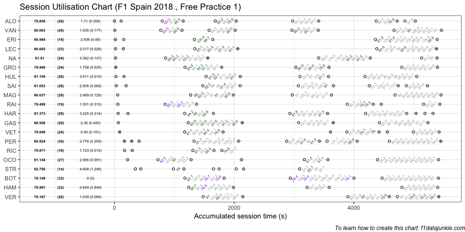
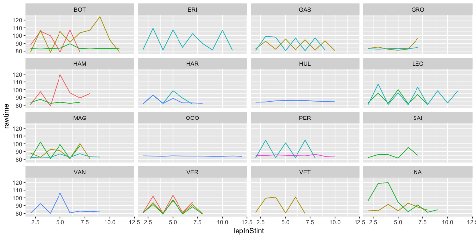

## Session Utilisation

Activity in Free Practice 1 took place as follows:

<!-- -->

### Performance Summary

| Driver            | Number | Fastest Lap | PerCent |   Gap |  Diff |
| :---------------- | -----: | ----------: | ------: | ----: | ----: |
| Valtteri BOTTAS   |     77 |      78.148 |   100.0 | 0.000 | 0.000 |
| Lewis HAMILTON    |     44 |      78.997 |   101.1 | 0.849 | 0.849 |
| Sebastian VETTEL  |      5 |      79.098 |   101.2 | 0.950 | 0.101 |
| Max VERSTAPPEN    |     33 |      79.187 |   101.3 | 1.039 | 0.089 |
| Kimi RAIKKONEN    |      7 |      79.499 |   101.7 | 1.351 | 0.312 |
| Fernando ALONSO   |     14 |      79.858 |   102.2 | 1.710 | 0.359 |
| Daniel RICCIARDO  |      3 |      79.871 |   102.2 | 1.723 | 0.013 |
| Romain GROSJEAN   |      8 |      79.906 |   102.2 | 1.758 | 0.035 |
| Stoffel VANDOORNE |      2 |      80.083 |   102.5 | 1.935 | 0.177 |
| Pierre GASLY      |     10 |      80.508 |   103.0 | 2.360 | 0.425 |
| Kevin MAGNUSSEN   |     20 |      80.637 |   103.2 | 2.489 | 0.129 |
| Charles LECLERC   |     16 |      80.665 |   103.2 | 2.517 | 0.028 |
| Sergio PEREZ      |     11 |      80.924 |   103.6 | 2.776 | 0.259 |
| Marcus ERICSSON   |      9 |      80.984 |   103.6 | 2.836 | 0.060 |
| Carlos SAINZ      |     55 |      81.053 |   103.7 | 2.905 | 0.069 |
| Esteban OCON      |     31 |      81.144 |   103.8 | 2.996 | 0.091 |
| Nico HULKENBERG   |     27 |      81.159 |   103.9 | 3.011 | 0.015 |
| Brendon HARTLEY   |     28 |      81.373 |   104.1 | 3.225 | 0.214 |
| Robert KUBICA     |     40 |      81.510 |   104.3 | 3.362 | 0.137 |
| Lance STROLL      |     18 |      82.756 |   105.9 | 4.608 | 1.246 |

In Free Practice 1, Valtteri BOTTAS topped the timing sheets with a
78.148s fastest lap, 0.849 ahead of Lewis HAMILTON in second.

### Stints Summary

| Driver            | Total laps | Longest run (laps) | Stints |
| :---------------- | ---------: | -----------------: | -----: |
| Sergio PEREZ      |         36 |                 11 |      7 |
| Valtteri BOTTAS   |         32 |                 12 |      3 |
| Pierre GASLY      |         29 |                 11 |      4 |
| Stoffel VANDOORNE |         28 |                 10 |      5 |
| Kevin MAGNUSSEN   |         28 |                 10 |      4 |
| Brendon HARTLEY   |         28 |                  9 |      8 |
| Carlos SAINZ      |         28 |                  8 |      6 |
| Esteban OCON      |         27 |                 13 |      5 |
| Nico HULKENBERG   |         26 |                 11 |      5 |
| Max VERSTAPPEN    |         26 |                  9 |      3 |
| Fernando ALONSO   |         26 |                  6 |      7 |
| Robert KUBICA     |         24 |                 10 |      4 |
| Sebastian VETTEL  |         24 |                  8 |      6 |
| Romain GROSJEAN   |         24 |                  8 |      4 |
| Charles LECLERC   |         23 |                 12 |      4 |
| Lewis HAMILTON    |         22 |                  9 |      3 |
| Kimi RAIKKONEN    |         19 |                  7 |      5 |
| Marcus ERICSSON   |         18 |                 12 |      4 |
| Lance STROLL      |         14 |                  5 |      5 |
| Daniel RICCIARDO  |         10 |                  5 |      4 |

  - Sergio PEREZ completed 36 laps over 7 stints, with a longest run of
    11 laps and a fastest lap of 80.924s overall (13th, 103.6% of
    session best).

  - Valtteri BOTTAS completed 32 laps over 3 stints, with a longest run
    of 12 laps and a fastest lap of 78.148s overall (1st, fastest in the
    session).

  - Pierre GASLY completed 29 laps over 4 stints, with a longest run of
    11 laps and a fastest lap of 80.508s overall (10th, 103% of session
    best).

  - Stoffel VANDOORNE completed 28 laps over 5 stints, with a longest
    run of 10 laps and a fastest lap of 80.083s overall (9th, 102.5% of
    session best).

  - Kevin MAGNUSSEN completed 28 laps over 4 stints, with a longest run
    of 10 laps and a fastest lap of 80.637s overall (11th, 103.2% of
    session best).

  - Brendon HARTLEY completed 28 laps over 8 stints, with a longest run
    of 9 laps and a fastest lap of 81.373s overall (18th, 104.1% of
    session best).

  - Carlos SAINZ completed 28 laps over 6 stints, with a longest run of
    8 laps and a fastest lap of 81.053s overall (15th, 103.7% of session
    best).

  - Esteban OCON completed 27 laps over 5 stints, with a longest run of
    13 laps and a fastest lap of 81.144s overall (16th, 103.8% of
    session best).

  - Nico HULKENBERG completed 26 laps over 5 stints, with a longest run
    of 11 laps and a fastest lap of 81.159s overall (17th, 103.9% of
    session best).

  - Max VERSTAPPEN completed 26 laps over 3 stints, with a longest run
    of 9 laps and a fastest lap of 79.187s overall (4th, 101.3% of
    session best).

  - Fernando ALONSO completed 26 laps over 7 stints, with a longest run
    of 6 laps and a fastest lap of 79.858s overall (6th, 102.2% of
    session best).

  - Robert KUBICA completed 24 laps over 4 stints, with a longest run of
    10 laps and a fastest lap of 81.51s overall (19th, 104.3% of session
    best).

  - Sebastian VETTEL completed 24 laps over 6 stints, with a longest run
    of 8 laps and a fastest lap of 79.098s overall (3rd, 101.2% of
    session best).

  - Romain GROSJEAN completed 24 laps over 4 stints, with a longest run
    of 8 laps and a fastest lap of 79.906s overall (8th, 102.2% of
    session best).

  - Charles LECLERC completed 23 laps over 4 stints, with a longest run
    of 12 laps and a fastest lap of 80.665s overall (12th, 103.2% of
    session best).

  - Lewis HAMILTON completed 22 laps over 3 stints, with a longest run
    of 9 laps and a fastest lap of 78.997s overall (2nd, 101.1% of
    session best).

  - Kimi RAIKKONEN completed 19 laps over 5 stints, with a longest run
    of 7 laps and a fastest lap of 79.499s overall (5th, 101.7% of
    session best).

  - Marcus ERICSSON completed 18 laps over 4 stints, with a longest run
    of 12 laps and a fastest lap of 80.984s overall (14th, 103.6% of
    session best).

  - Lance STROLL completed 14 laps over 5 stints, with a longest run of
    5 laps and a fastest lap of 82.756s overall (20th, 105.9% of session
    best).

  - Daniel RICCIARDO completed 10 laps over 4 stints, with a longest run
    of 5 laps and a fastest lap of 79.871s overall (7th, 102.2% of
    session best).

### Long Runs

Laptimes on long runs of 8 or more laps
<!-- -->

-----

This website is unofficial and is not associated in any way with the
Formula 1 companies. F1, FORMULA ONE, FORMULA 1, FIA FORMULA ONE WORLD
CHAMPIONSHIP, GRAND PRIX and related marks are trade marks of Formula
One Licensing B.V.
