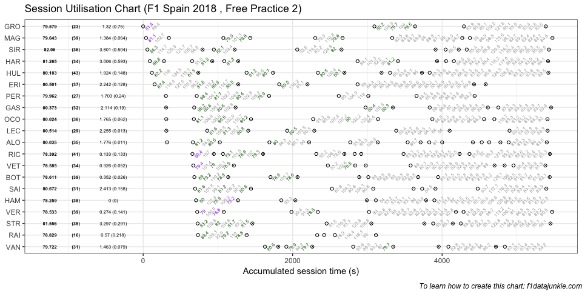
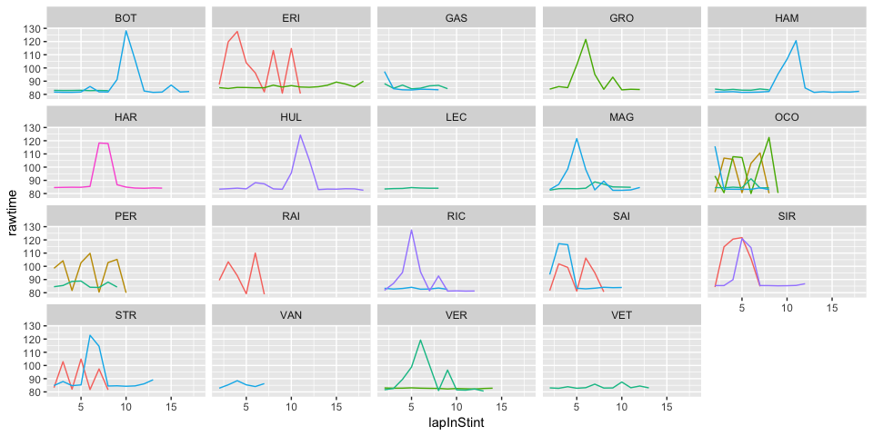

## Session Utilisation

Activity in Free Practice 2 took place as follows:

<!-- -->

### Performance Summary

| Driver            | Number | Fastest Lap | PerCent |   Gap |  Diff |
| :---------------- | -----: | ----------: | ------: | ----: | ----: |
| Lewis HAMILTON    |     44 |      78.259 |   100.0 | 0.000 | 0.000 |
| Daniel RICCIARDO  |      3 |      78.392 |   100.2 | 0.133 | 0.133 |
| Max VERSTAPPEN    |     33 |      78.533 |   100.4 | 0.274 | 0.141 |
| Sebastian VETTEL  |      5 |      78.585 |   100.4 | 0.326 | 0.052 |
| Valtteri BOTTAS   |     77 |      78.611 |   100.4 | 0.352 | 0.026 |
| Kimi RAIKKONEN    |      7 |      78.829 |   100.7 | 0.570 | 0.218 |
| Romain GROSJEAN   |      8 |      79.579 |   101.7 | 1.320 | 0.750 |
| Kevin MAGNUSSEN   |     20 |      79.643 |   101.8 | 1.384 | 0.064 |
| Stoffel VANDOORNE |      2 |      79.722 |   101.9 | 1.463 | 0.079 |
| Sergio PEREZ      |     11 |      79.962 |   102.2 | 1.703 | 0.240 |
| Esteban OCON      |     31 |      80.024 |   102.3 | 1.765 | 0.062 |
| Fernando ALONSO   |     14 |      80.035 |   102.3 | 1.776 | 0.011 |
| Nico HULKENBERG   |     27 |      80.183 |   102.5 | 1.924 | 0.148 |
| Pierre GASLY      |     10 |      80.373 |   102.7 | 2.114 | 0.190 |
| Marcus ERICSSON   |      9 |      80.501 |   102.9 | 2.242 | 0.128 |
| Charles LECLERC   |     16 |      80.514 |   102.9 | 2.255 | 0.013 |
| Carlos SAINZ      |     55 |      80.672 |   103.1 | 2.413 | 0.158 |
| Brendon HARTLEY   |     28 |      81.265 |   103.8 | 3.006 | 0.593 |
| Lance STROLL      |     18 |      81.556 |   104.2 | 3.297 | 0.291 |
| Sergey SIROTKIN   |     35 |      82.060 |   104.9 | 3.801 | 0.504 |

In Free Practice 2, Lewis HAMILTON topped the timing sheets with a
78.259s fastest lap, 0.133 ahead of Daniel RICCIARDO in second.

### Stints Summary

| Driver            | Total laps | Longest run (laps) | Stints |
| :---------------- | ---------: | -----------------: | -----: |
| Nico HULKENBERG   |         43 |                 19 |      6 |
| Daniel RICCIARDO  |         41 |                 13 |      6 |
| Valtteri BOTTAS   |         39 |                 18 |      5 |
| Max VERSTAPPEN    |         39 |                 15 |      4 |
| Kevin MAGNUSSEN   |         39 |                 13 |      5 |
| Lewis HAMILTON    |         38 |                 18 |      5 |
| Esteban OCON      |         38 |                 10 |      5 |
| Marcus ERICSSON   |         37 |                 19 |      4 |
| Sergey SIROTKIN   |         36 |                 13 |      6 |
| Lance STROLL      |         35 |                 14 |      5 |
| Fernando ALONSO   |         35 |                  7 |     10 |
| Brendon HARTLEY   |         34 |                 15 |      7 |
| Sebastian VETTEL  |         34 |                 14 |      6 |
| Pierre GASLY      |         32 |                 10 |      5 |
| Carlos SAINZ      |         31 |                 11 |      5 |
| Stoffel VANDOORNE |         31 |                  8 |      6 |
| Charles LECLERC   |         29 |                  9 |      5 |
| Sergio PEREZ      |         27 |                 11 |      4 |
| Romain GROSJEAN   |         23 |                 13 |      3 |
| Kimi RAIKKONEN    |         16 |                  8 |      3 |

  - Nico HULKENBERG completed 43 laps over 6 stints, with a longest run
    of 19 laps and a fastest lap of 80.183s overall (13th, 102.5% of
    session best).

  - Daniel RICCIARDO completed 41 laps over 6 stints, with a longest run
    of 13 laps and a fastest lap of 78.392s overall (2nd, 100.2% of
    session best).

  - Valtteri BOTTAS completed 39 laps over 5 stints, with a longest run
    of 18 laps and a fastest lap of 78.611s overall (5th, 100.4% of
    session best).

  - Max VERSTAPPEN completed 39 laps over 4 stints, with a longest run
    of 15 laps and a fastest lap of 78.533s overall (3rd, 100.4% of
    session best).

  - Kevin MAGNUSSEN completed 39 laps over 5 stints, with a longest run
    of 13 laps and a fastest lap of 79.643s overall (8th, 101.8% of
    session best).

  - Lewis HAMILTON completed 38 laps over 5 stints, with a longest run
    of 18 laps and a fastest lap of 78.259s overall (1st, fastest in the
    session).

  - Esteban OCON completed 38 laps over 5 stints, with a longest run of
    10 laps and a fastest lap of 80.024s overall (11th, 102.3% of
    session best).

  - Marcus ERICSSON completed 37 laps over 4 stints, with a longest run
    of 19 laps and a fastest lap of 80.501s overall (15th, 102.9% of
    session best).

  - Sergey SIROTKIN completed 36 laps over 6 stints, with a longest run
    of 13 laps and a fastest lap of 82.06s overall (20th, 104.9% of
    session best).

  - Lance STROLL completed 35 laps over 5 stints, with a longest run of
    14 laps and a fastest lap of 81.556s overall (19th, 104.2% of
    session best).

  - Fernando ALONSO completed 35 laps over 10 stints, with a longest run
    of 7 laps and a fastest lap of 80.035s overall (12th, 102.3% of
    session best).

  - Brendon HARTLEY completed 34 laps over 7 stints, with a longest run
    of 15 laps and a fastest lap of 81.265s overall (18th, 103.8% of
    session best).

  - Sebastian VETTEL completed 34 laps over 6 stints, with a longest run
    of 14 laps and a fastest lap of 78.585s overall (4th, 100.4% of
    session best).

  - Pierre GASLY completed 32 laps over 5 stints, with a longest run of
    10 laps and a fastest lap of 80.373s overall (14th, 102.7% of
    session best).

  - Carlos SAINZ completed 31 laps over 5 stints, with a longest run of
    11 laps and a fastest lap of 80.672s overall (17th, 103.1% of
    session best).

  - Stoffel VANDOORNE completed 31 laps over 6 stints, with a longest
    run of 8 laps and a fastest lap of 79.722s overall (9th, 101.9% of
    session best).

  - Charles LECLERC completed 29 laps over 5 stints, with a longest run
    of 9 laps and a fastest lap of 80.514s overall (16th, 102.9% of
    session best).

  - Sergio PEREZ completed 27 laps over 4 stints, with a longest run of
    11 laps and a fastest lap of 79.962s overall (10th, 102.2% of
    session best).

  - Romain GROSJEAN completed 23 laps over 3 stints, with a longest run
    of 13 laps and a fastest lap of 79.579s overall (7th, 101.7% of
    session best).

  - Kimi RAIKKONEN completed 16 laps over 3 stints, with a longest run
    of 8 laps and a fastest lap of 78.829s overall (6th, 100.7% of
    session best).

### Long Runs

Laptimes on long runs of 8 or more laps
<!-- -->

-----

This website is unofficial and is not associated in any way with the
Formula 1 companies. F1, FORMULA ONE, FORMULA 1, FIA FORMULA ONE WORLD
CHAMPIONSHIP, GRAND PRIX and related marks are trade marks of Formula
One Licensing B.V.
