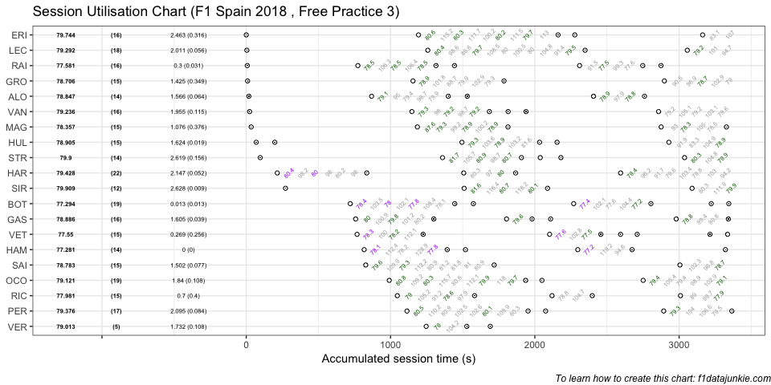
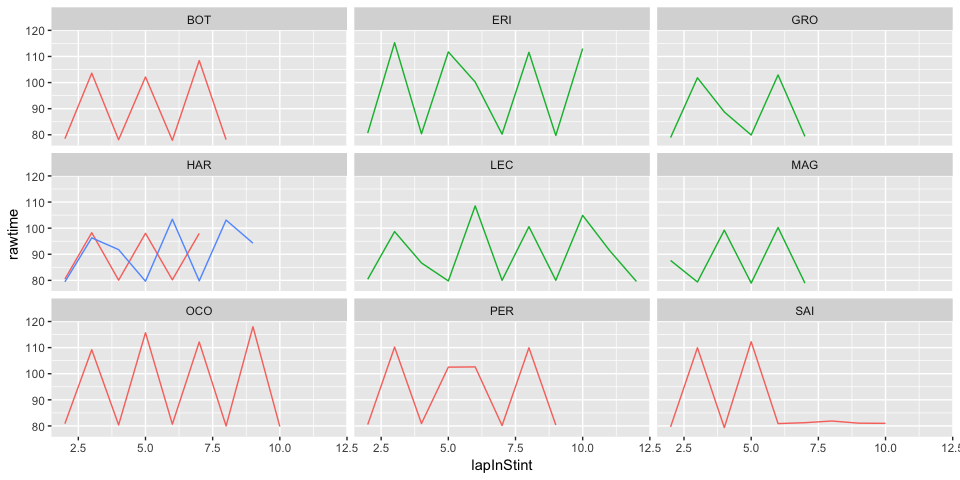

## Session Utilisation

Activity in Free Practice 3 took place as follows:

<!-- -->

### Performance Summary

| Driver            | Number | Fastest Lap | PerCent |   Gap |  Diff |
| :---------------- | -----: | ----------: | ------: | ----: | ----: |
| Lewis HAMILTON    |     44 |      77.281 |   100.0 | 0.000 | 0.000 |
| Valtteri BOTTAS   |     77 |      77.294 |   100.0 | 0.013 | 0.013 |
| Sebastian VETTEL  |      5 |      77.550 |   100.3 | 0.269 | 0.256 |
| Kimi RAIKKONEN    |      7 |      77.581 |   100.4 | 0.300 | 0.031 |
| Daniel RICCIARDO  |      3 |      77.981 |   100.9 | 0.700 | 0.400 |
| Kevin MAGNUSSEN   |     20 |      78.357 |   101.4 | 1.076 | 0.376 |
| Romain GROSJEAN   |      8 |      78.706 |   101.8 | 1.425 | 0.349 |
| Carlos SAINZ      |     55 |      78.783 |   101.9 | 1.502 | 0.077 |
| Fernando ALONSO   |     14 |      78.847 |   102.0 | 1.566 | 0.064 |
| Pierre GASLY      |     10 |      78.886 |   102.1 | 1.605 | 0.039 |
| Nico HULKENBERG   |     27 |      78.905 |   102.1 | 1.624 | 0.019 |
| Max VERSTAPPEN    |     33 |      79.013 |   102.2 | 1.732 | 0.108 |
| Esteban OCON      |     31 |      79.121 |   102.4 | 1.840 | 0.108 |
| Stoffel VANDOORNE |      2 |      79.236 |   102.5 | 1.955 | 0.115 |
| Charles LECLERC   |     16 |      79.292 |   102.6 | 2.011 | 0.056 |
| Sergio PEREZ      |     11 |      79.376 |   102.7 | 2.095 | 0.084 |
| Brendon HARTLEY   |     28 |      79.428 |   102.8 | 2.147 | 0.052 |
| Marcus ERICSSON   |      9 |      79.744 |   103.2 | 2.463 | 0.316 |
| Lance STROLL      |     18 |      79.900 |   103.4 | 2.619 | 0.156 |
| Sergey SIROTKIN   |     35 |      79.909 |   103.4 | 2.628 | 0.009 |

In Free Practice 3, Lewis HAMILTON topped the timing sheets with a
77.281s fastest lap, 0.013 ahead of Valtteri BOTTAS in second.

### Stints Summary

| Driver            | Total laps | Longest run (laps) | Stints |
| :---------------- | ---------: | -----------------: | -----: |
| Brendon HARTLEY   |         22 |                  9 |      3 |
| Esteban OCON      |         19 |                 11 |      3 |
| Valtteri BOTTAS   |         19 |                  9 |      5 |
| Charles LECLERC   |         18 |                 13 |      3 |
| Sergio PEREZ      |         17 |                 10 |      3 |
| Marcus ERICSSON   |         16 |                 11 |      4 |
| Stoffel VANDOORNE |         16 |                  7 |      5 |
| Pierre GASLY      |         16 |                  7 |      4 |
| Kimi RAIKKONEN    |         16 |                  7 |      5 |
| Carlos SAINZ      |         15 |                 11 |      2 |
| Romain GROSJEAN   |         15 |                  8 |      3 |
| Kevin MAGNUSSEN   |         15 |                  8 |      3 |
| Nico HULKENBERG   |         15 |                  7 |      5 |
| Daniel RICCIARDO  |         15 |                  7 |      3 |
| Sebastian VETTEL  |         15 |                  6 |      6 |
| Lewis HAMILTON    |         14 |                  7 |      4 |
| Lance STROLL      |         14 |                  7 |      4 |
| Fernando ALONSO   |         14 |                  7 |      4 |
| Sergey SIROTKIN   |         12 |                  7 |      3 |
| Max VERSTAPPEN    |          5 |                  4 |      2 |

  - Brendon HARTLEY completed 22 laps over 3 stints, with a longest run
    of 9 laps and a fastest lap of 79.428s overall (17th, 102.8% of
    session best).

  - Esteban OCON completed 19 laps over 3 stints, with a longest run of
    11 laps and a fastest lap of 79.121s overall (13th, 102.4% of
    session best).

  - Valtteri BOTTAS completed 19 laps over 5 stints, with a longest run
    of 9 laps and a fastest lap of 77.294s overall (2nd, just 0.013s
    behind the fastest time in the session).

  - Charles LECLERC completed 18 laps over 3 stints, with a longest run
    of 13 laps and a fastest lap of 79.292s overall (15th, 102.6% of
    session best).

  - Sergio PEREZ completed 17 laps over 3 stints, with a longest run of
    10 laps and a fastest lap of 79.376s overall (16th, 102.7% of
    session best).

  - Marcus ERICSSON completed 16 laps over 4 stints, with a longest run
    of 11 laps and a fastest lap of 79.744s overall (18th, 103.2% of
    session best).

  - Stoffel VANDOORNE completed 16 laps over 5 stints, with a longest
    run of 7 laps and a fastest lap of 79.236s overall (14th, 102.5% of
    session best).

  - Pierre GASLY completed 16 laps over 4 stints, with a longest run of
    7 laps and a fastest lap of 78.886s overall (10th, 102.1% of session
    best).

  - Kimi RAIKKONEN completed 16 laps over 5 stints, with a longest run
    of 7 laps and a fastest lap of 77.581s overall (4th, 100.4% of
    session best).

  - Carlos SAINZ completed 15 laps over 2 stints, with a longest run of
    11 laps and a fastest lap of 78.783s overall (8th, 101.9% of session
    best).

  - Romain GROSJEAN completed 15 laps over 3 stints, with a longest run
    of 8 laps and a fastest lap of 78.706s overall (7th, 101.8% of
    session best).

  - Kevin MAGNUSSEN completed 15 laps over 3 stints, with a longest run
    of 8 laps and a fastest lap of 78.357s overall (6th, 101.4% of
    session best).

  - Nico HULKENBERG completed 15 laps over 5 stints, with a longest run
    of 7 laps and a fastest lap of 78.905s overall (11th, 102.1% of
    session best).

  - Daniel RICCIARDO completed 15 laps over 3 stints, with a longest run
    of 7 laps and a fastest lap of 77.981s overall (5th, 100.9% of
    session best).

  - Sebastian VETTEL completed 15 laps over 6 stints, with a longest run
    of 6 laps and a fastest lap of 77.55s overall (3rd, 100.3% of
    session best).

  - Lewis HAMILTON completed 14 laps over 4 stints, with a longest run
    of 7 laps and a fastest lap of 77.281s overall (1st, fastest in the
    session).

  - Lance STROLL completed 14 laps over 4 stints, with a longest run of
    7 laps and a fastest lap of 79.9s overall (19th, 103.4% of session
    best).

  - Fernando ALONSO completed 14 laps over 4 stints, with a longest run
    of 7 laps and a fastest lap of 78.847s overall (9th, 102% of session
    best).

  - Sergey SIROTKIN completed 12 laps over 3 stints, with a longest run
    of 7 laps and a fastest lap of 79.909s overall (20th, 103.4% of
    session best).

  - Max VERSTAPPEN completed 5 laps over 2 stints, with a longest run of
    4 laps and a fastest lap of 79.013s overall (12th, 102.2% of session
    best).

### Long Runs

Laptimes on long runs of 8 or more laps
<!-- -->

-----

This website is unofficial and is not associated in any way with the
Formula 1 companies. F1, FORMULA ONE, FORMULA 1, FIA FORMULA ONE WORLD
CHAMPIONSHIP, GRAND PRIX and related marks are trade marks of Formula
One Licensing B.V.
