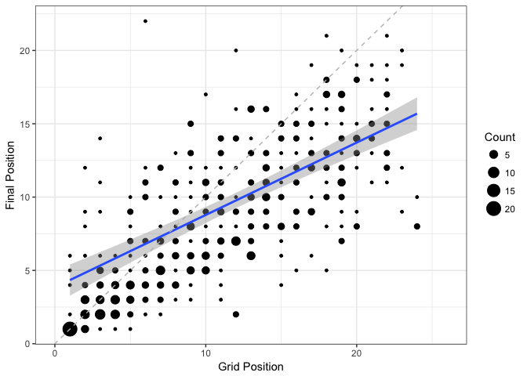
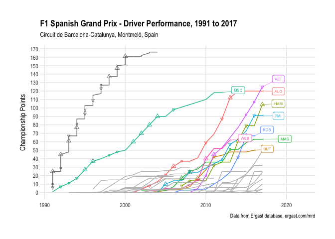
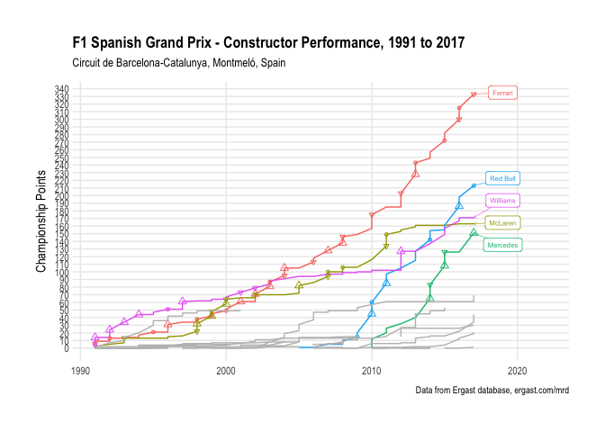

### Drivers’ & Constructors’ Circuit Performance

How well do drivers and constructors perform at the circuit?

The *Driver Performance Chart* and *Constructor Performance Chart* show
how drivers and constructors fare based on points scored at the circuit.
(Note that points schemes may change over the reporting period.)

<!-- -->

Historical likelihood of winning from pole: 74.07, NA%

<!-- -->

Poles at this circuit:

| Driver | Poles |
| :----- | ----: |
| MSC    |     7 |
| NA     |     6 |
| HAM    |     3 |
| WEB    |     2 |
| RAI    |     2 |
| ROS    |     2 |
| BUT    |     1 |
| MAL    |     1 |
| MAS    |     1 |
| ALO    |     1 |
| VIL    |     1 |

Individual winners at this circuit:

| Driver | Wins |
| :----- | ---: |
| RAI    |    2 |
| ALO    |    2 |
| HAM    |    2 |
| VET    |    1 |
| VER    |    1 |

Podiums at this circuit:

| Driver | Podiums |
| :----- | ------: |
| ALO    |       7 |
| HAM    |       6 |
| RAI    |       5 |
| VET    |       5 |
| RIC    |       2 |
| VER    |       1 |

<!-- -->
