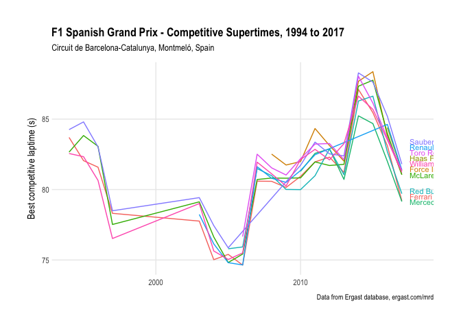
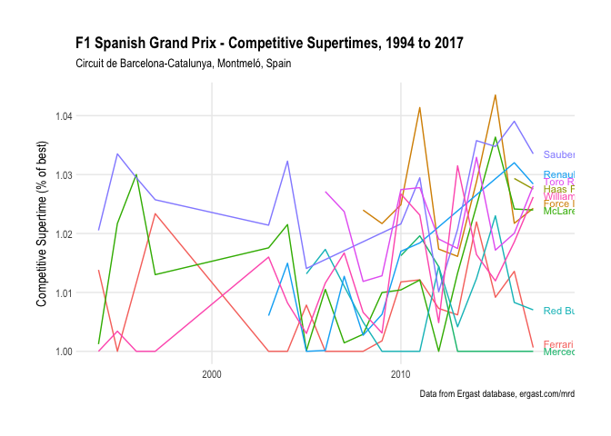
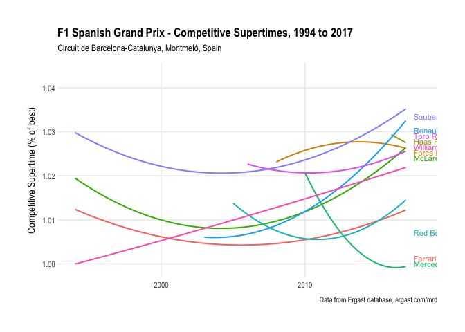
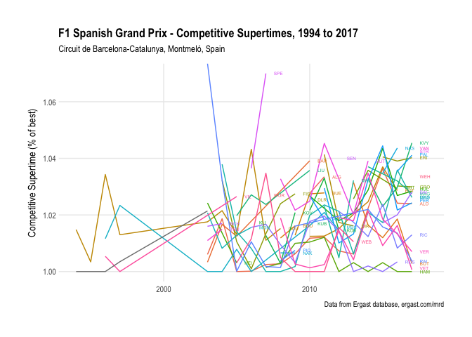
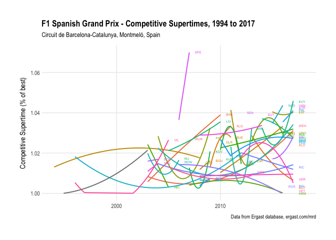

## Drivers’ & Constructors’ Competitive Laptime Evolution

Evolution of best competitive laptime over the years, based on the best
laptimes recorded in either qualifying or the race.

<!-- -->

### Circuit Competitive Supertimes

*Supertimes* are often provided as a season wide performance metric for
comparing performances over a season. At the manufacturer level, they
are typically calculated for each manufacturer as the average of their
fastest single lap recorded by the team at each race weekend expressed
as a percentage of the fastest single lap overall.

We can also derive a reduced *competitive supertime* by basing the
calculation on best laptime recorded across the qualifying and race
sessions, omitting laptimes recorded in the practice sessions.

We can draw on the notion of supertimes to derive two simple measures
for comparing team performances based on laptime:

  - evolution of manufacturer competitive supertime for a circuit over
    the years;
  - evolution of manufacturer competitive supertime for each circuit
    over the course of a season.

We can also produce driver performance metrics based on the competitive
supertime of each driver.

<!-- -->

<!-- -->

<!-- -->

<!-- -->

| code |  avstime | races |
| :--- | -------: | ----: |
| HAM  | 1.003930 |    11 |
| VET  | 1.009138 |    10 |
| ALO  | 1.012043 |    15 |
| RIC  | 1.016008 |     6 |
| BOT  | 1.016254 |     5 |
| VER  | 1.018428 |     6 |
| SAI  | 1.021764 |     3 |
| PER  | 1.025110 |     7 |
| OCO  | 1.025256 |     1 |
| HUL  | 1.027564 |     7 |
| GRO  | 1.030081 |     2 |
| MAG  | 1.032198 |     3 |
| ERI  | 1.039927 |     3 |
| STR  | 1.041213 |     1 |
| VAN  | 1.042742 |     1 |
| RAI  |      Inf |    11 |
