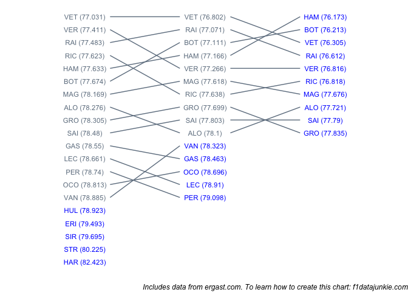
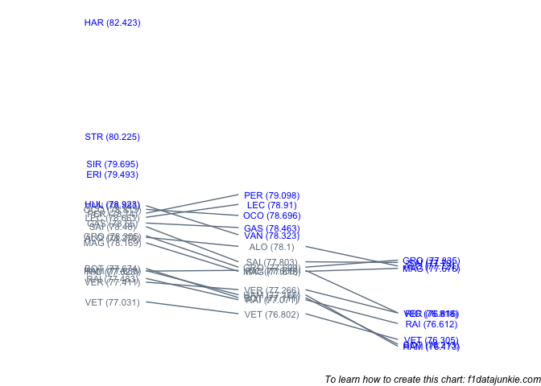

Drivers progressed through the qualifying session as follows:

<!-- -->

<!-- -->

## Q1 into Q2

The following teams did not make it through:

| TEAM       | freq |
| :--------- | ---: |
| Sauber     |    1 |
| Toro Rosso |    1 |
| Williams   |    2 |

  - neither Williams made it through from Q1 to Q2

  - RIC failed to improve his time from Q1, recording 77.638 compared to
    77.623 (0.015s slower)

  - LEC failed to improve his time from Q1, recording 78.91 compared to
    78.661 (0.249s slower)

  - PER failed to improve his time from Q1, recording 79.098 compared to
    78.74 (0.358s slower)

## Q2 into Q3

The following teams did not make it through:

| TEAM        | freq |
| :---------- | ---: |
| Force India |    2 |
| McLaren     |    1 |
| Renault     |    1 |
| Sauber      |    1 |
| Toro Rosso  |    1 |

  - neither Force India made it through from Q2 to Q3

  - both Ferrari cars made it through to Q3

  - both Haas F1 Team cars made it through to Q3

  - both Mercedes cars made it through to Q3

  - both Red Bull cars made it through to Q3

  - MAG failed to improve his time from Q2, recording 77.676 compared to
    77.618 (0.058s slower)

  - GRO failed to improve his time from Q2, recording 77.835 compared to
    77.699 (0.136s slower)
