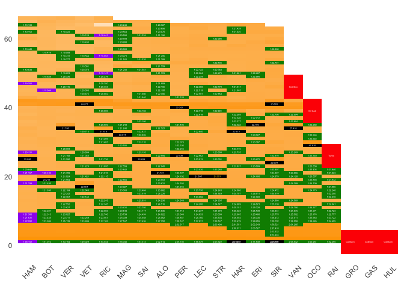
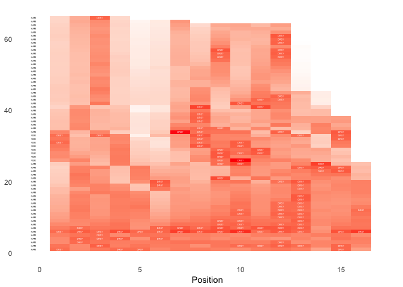
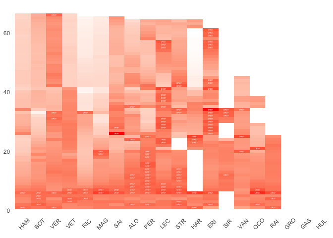

## Lap Analysis

<!-- -->

<!-- -->

## Variant

Do a variant where the x is pos on lap and y label is leader label

Diff map by pos

  - the only difference between this and above are the scales

<!-- -->

Then do an analysis to see how each driver is threatened?

<!-- -->
